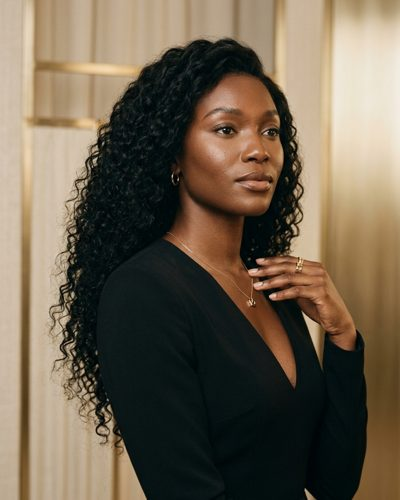
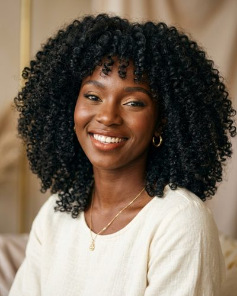
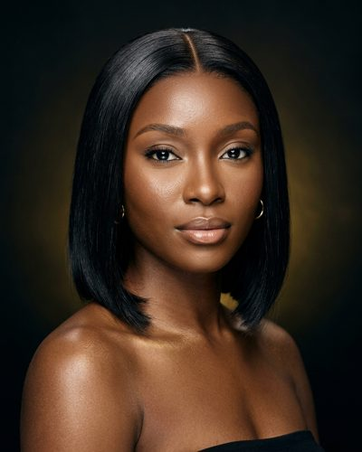
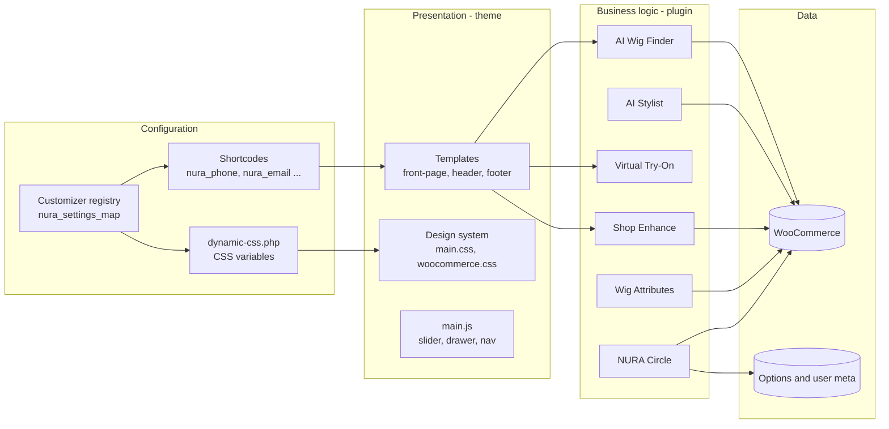
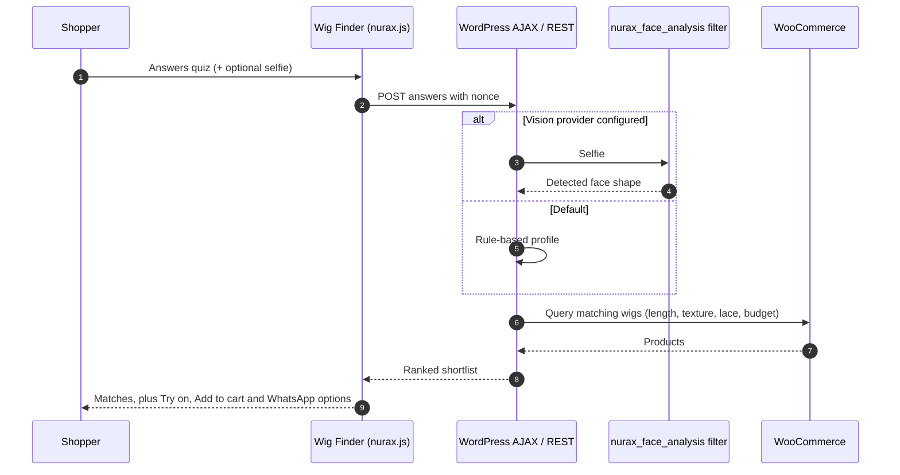
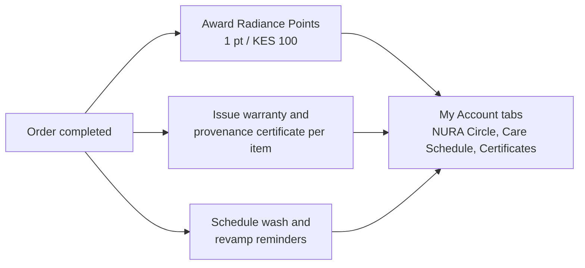
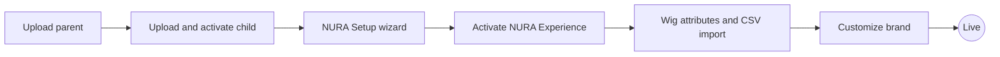

<div align="center">


# NURA Beauty
### *The House of Radiant Confidence*

**Luxury WordPress + WooCommerce platform for [nurabeauty.co.ke](https://nurabeauty.co.ke/)**: premium human-hair and HD-lace wigs, hand-finished in Nairobi.


[**Live site**](https://nurabeauty.co.ke/) · [Shop](https://nurabeauty.co.ke/shop/) · [AI Wig Finder](https://nurabeauty.co.ke/ai-wig-finder/) · [Architecture](#architecture) · [Installation](#installation) · [Configuration](#configuration)

</div>

---


## Table of contents
1. [Overview](#overview)
2. [Screenshots](#screenshots)
3. [Collections](#collections)
4. [Features](#features)
5. [Architecture](#architecture)
6. [Project structure](#project-structure)
7. [Installation](#installation)
8. [Configuration](#configuration)
9. [Shortcodes and REST API](#shortcodes-and-rest-api)
10. [Extending with AI providers](#extending-with-ai-providers)
11. [Performance, SEO and security](#performance-seo-and-security)
12. [Business](#business)

## Overview

NURA Beauty is a premium wig and beauty brand based in Nairobi. This repository holds the full custom platform behind the live store. The design brief was *"Apple meets Chanel meets Sephora"*: an editorial, minimal storefront with AI-assisted shopping on top of WooCommerce.

| Package | Folder | Version | Role |
| --- | --- | --- | --- |
| **NURA Beauty** (parent theme) | [`nura-beauty/`](nura-beauty) | 1.27.0 | Storefront, design system, Customizer, SEO schema, one-click setup and sample data |
| **NURA Beauty Child** | [`nura-beauty-child/`](nura-beauty-child) | 1.0.0 | **Active theme.** Update-safe layer for site-specific CSS and PHP |
| **NURA Experience** (plugin) | [`nura-experience/`](nura-experience) | 1.38.1 | AI Wig Finder, AI Stylist chat, Virtual Try-On, NURA Circle client portal, shop enhancements and wig attributes |

> **Design principle:** nothing is hard-coded. Every colour, font, contact detail, hero slide, trust badge and payment label is edited in **Appearance > Customize > NURA Options**, so the store can be rebranded without a developer.

## Screenshots

| Shop with wig filters | AI Wig Finder |
| --- | --- |
|  |  |

<p align="center">
  <br>
  <sub>Mobile-first homepage with an app-style bottom navigation bar and WhatsApp concierge button</sub>
</p>

## Collections

<table>
  <tr>
    <td align="center"><br><sub><b>Wigs</b><br>Human hair, lace, glueless</sub></td>
    <td align="center"><br><sub><b>HD Lace Front</b><br>Invisible hairline</sub></td>
    <td align="center"><br><sub><b>Ready-to-Wear</b><br>Glueless, everyday units</sub></td>
    <td align="center"><br><sub><b>Bridal & Occasion</b><br>Custom bridal units</sub></td>
    <td align="center"><br><sub><b>Confidence Line</b><br>Comfort-first units</sub></td>
  </tr>
</table>

<table>
  <tr>
    <td align="center"></td>
    <td align="center"></td>
    <td align="center"></td>
  </tr>
  <tr>
    <td align="center"><sub>Editorial</sub></td>
    <td align="center"><sub>Curls</sub></td>
    <td align="center"><sub>Bob</sub></td>
  </tr>
</table>

## Features

### Storefront (NURA Beauty theme)
- **Luxury editorial design:** obsidian black, champagne gold `#C9A24B`, warm ivory, aubergine and soft nude, with Playfair Display, Cormorant Garamond, Montserrat and Jost type
- **Hero slider**, trust bar, category tiles, *Shop by wig type*, New Arrivals, Best Sellers, a "Real women, real crowns" gallery, wig care and a "Talk to NURA" contact block
- **Mobile app-style bottom navigation** (Home, Shop, Saved, Cart, Menu) and a floating WhatsApp button
- **One-click onboarding:** *Appearance > NURA Setup* installs required plugins from WordPress.org and imports sample pages and products
- **Ready-made pages:** About, Installation, Book Appointment, Bulk & Corporate Orders, Delivery, Shipping, Returns & Refunds, Warranty, Track Order, FAQ, Help & Support, NURA Circle, AI Wig Finder and Virtual Try-On
- **Contact and booking forms** that switch to Contact Form 7 automatically when it is installed

### Experience layer (NURA Experience plugin)
| Module | What it does |
| --- | --- |
| **AI Wig Finder** | A quiz on face shape, skin tone, lifestyle and budget, with an optional selfie, that recommends matching WooCommerce products. A rule-based matcher works out of the box, and a vision API can be added |
| **AI Stylist** | A floating chat concierge connected to **OpenAI or Google Gemini**. Without an API key it falls back to guided replies, product picks and a WhatsApp hand-off, so the chat always works |
| **Virtual Try-On** | Upload a photo and place a wig over it with drag, size and blend controls. Adds a **Try on** button to product cards. Can be upgraded to face-tracked try-on |
| **The NURA Circle** | Client portal in My Account: loyalty **Radiance Points** (1 point per KES 100), wash and revamp reminders, warranty and provenance certificates per item, and VIP membership |
| **Shop enhancements** | Category filter pills, a REST-powered **Quick View** modal and filters for hair type, texture, length, colour, lace type, price and stock |
| **Wig Setup** | One click creates the global **Length, Texture, Lace Type, Density and Colour** attributes for variable products, plus a downloadable CSV template |

## Architecture

### System context

```mermaid
flowchart TB
    subgraph Users
        C[Shopper - web and mobile]
        A[Store admin]
    end
    subgraph WP["WordPress - nurabeauty.co.ke"]
        direction TB
        CH[NURA Beauty Child<br/>active theme]
        PT[NURA Beauty<br/>parent theme]
        NX[NURA Experience<br/>plugin]
        WC[(WooCommerce<br/>products, orders, customers)]
        CH --> PT
        PT --> WC
        NX --> WC
    end
    subgraph External["External services (optional)"]
        LLM[OpenAI / Google Gemini]
        VIS[Face-analysis API]
        AR[AR try-on provider<br/>MediaPipe / Banuba]
        WA[WhatsApp]
        GF[Google Fonts]
    end
    C --> CH
    A --> PT
    NX -- AI Stylist REST proxy --> LLM
    NX -- nurax_face_analysis filter --> VIS
    NX -. window.nuraxTryonProvider .-> AR
    CH --> WA
    PT --> GF
```

### Layered design



### Flow: AI Wig Finder



### Flow: NURA Circle loyalty



## Project structure

```text
.
├── README.md
├── docs/
│   ├── screenshots/                 # Live-site screenshots used in this README
│   └── images/                      # Optimised collection and lookbook images
├── nura-beauty/                     # Parent theme
│   ├── functions.php                # Lean bootstrap, guarded includes
│   ├── inc/
│   │   ├── setup.php                # Theme supports, menus, image sizes
│   │   ├── enqueue.php              # Critical CSS and async assets
│   │   ├── customizer.php           # Single registry of every brand setting
│   │   ├── dynamic-css.php          # Customizer values to CSS variables
│   │   ├── woocommerce-support.php  # Shop and product integration
│   │   ├── seo-schema.php           # JSON-LD, Open Graph, Twitter
│   │   ├── shortcodes.php           # Brand value, contact and booking shortcodes
│   │   ├── template-tags.php        # Template helpers
│   │   ├── required-plugins.php     # One-click installer from WordPress.org
│   │   └── sample-data.php / sample-content.php
│   ├── assets/{css,js,images}/      # Design system, main.js, hero and category photos
│   ├── demo/pages/*.html            # Starter page content
│   ├── front-page.php  header.php  footer.php  page.php  single.php ...
│   └── style.css                    # Theme header only
├── nura-beauty-child/               # Child theme (activate this)
└── nura-experience/                 # Experience plugin
    ├── nura-experience.php          # Bootstrap and shared assets
    ├── includes/
    │   ├── class-ai-wig-finder.php
    │   ├── class-ai-stylist.php
    │   ├── class-virtual-tryon.php
    │   ├── class-nura-circle.php
    │   ├── class-shop-enhance.php
    │   ├── class-wig-attributes.php
    │   └── class-settings.php
    ├── assets/{css,js}/nurax.*
    └── samples/nura-variable-products-template.csv
```

## Installation

**Requirements:** WordPress 6.2 or later · WooCommerce 8.0 or later (tested to 9.1) · PHP 7.4 or later

1. Zip and upload **`nura-beauty/`**, then **`nura-beauty-child/`**, under *Appearance > Themes > Add New > Upload Theme*.
2. **Activate NURA Beauty Child**, not the parent.
3. Open **Appearance > NURA Setup** and run both steps: install plugins (WooCommerce is required; Contact Form 7, Yoast SEO and Kadence Blocks are recommended), then import sample content.
4. Upload **`nura-experience/`** to `wp-content/plugins/` and activate **NURA Experience**.
5. Go to **WooCommerce > NURA Wig Setup** and click once to create the wig attributes. Use the sample CSV to import variable products.
6. Re-save **Settings > Permalinks** so the NURA Circle account tabs register.



> **Deployment:** commits to this repository do **not** deploy automatically. Upload the changed theme or plugin folder to hosting for updates to go live.

## Configuration

| Where | What you can change |
| --- | --- |
| **Customize > NURA Options > Colours** | Ink, gold, ivory, aubergine and nude. The whole theme updates instantly |
| **Customize > NURA Options > Typography** | Display, editorial, body and UI Google Font families |
| **Customize > NURA Options > Brand** | Name, tagline, bio, announcement bar, phone, WhatsApp, email, address, hours, and Instagram, TikTok and Facebook links |
| **Customize > NURA Options > Homepage** | Hero slides, buttons, trust bar, feature blocks and payment badges |
| **Settings > NURA Experience** | OpenAI or Gemini API key, vision endpoint, VIP price and loyalty options |

## Shortcodes and REST API

| Shortcode | Output |
| --- | --- |
| `[nura_ai_wig_finder]` | AI Wig Finder quiz and results |
| `[nura_virtual_tryon]` | Virtual Try-On studio |
| `[nura_circle_portal]` | NURA Circle client portal |
| `[nura_contact_form]` | Contact form (uses Contact Form 7 when available) |
| `[nura_phone]` `[nura_email]` `[nura_address]` `[nura_hours]` `[nura_whatsapp]` | Live brand values from the Customizer |

REST namespace: `nurax/v1`. Examples: `POST /stylist` for the AI Stylist chat, and the Quick View product endpoint.

## Extending with AI providers

```php
// Plug a real face-shape vision model into the AI Wig Finder.
add_filter( 'nurax_face_analysis', function ( $shape, $image ) {
    // Call your provider and return e.g. 'oval', 'round', 'heart', 'square'.
    return $shape;
}, 10, 2 );
```

```js
// Swap in a face-tracked AR engine for Virtual Try-On; the UI stays identical.
window.nuraxTryonProvider = { align: (photo, wig) => { /* MediaPipe / Banuba */ } };
```

> **Scope note:** the recommender, try-on overlay and portal work fully as they are. Face-shape detection from photos and automatically aligned AR try-on need a third-party vision service and API key. The plugin is built to plug those in.

## Performance, SEO and security

- **Performance:** critical CSS with async stylesheets, a lean bootstrap, vanilla JavaScript and lazy-loaded media
- **SEO:** JSON-LD for Organization, WebSite and SearchAction, Product, BreadcrumbList and FAQPage, plus Open Graph and Twitter Cards. It switches off when Yoast, Rank Math or SEOPress is active, so schema is never duplicated
- **Security:** nonce-guarded AJAX, REST and admin actions, sanitised Customizer settings, escaped output, and AI keys kept on the server, never in the browser
- **Accessibility and i18n:** translation-ready (`nura-beauty` and `nura-experience` text domains)

## Business

**NURA Beauty: The House of Radiant Confidence**
Imenti House, Moi Avenue, Nairobi CBD, Kenya
Phone and WhatsApp: [+254 714 994 898](tel:+254714994898) · Email: [care@nurabeauty.co.ke](mailto:care@nurabeauty.co.ke)
Hours: Mon - Sat, 9:00 - 18:00 · Same-day Nairobi delivery on orders placed before 5pm · Countrywide delivery in 1 - 3 days

## Credits

Designed, developed and maintained by **[Pimofy Digital](https://github.com/moselanto)**, Nairobi.

## License

GNU General Public License v2 or later. See the [license text](http://www.gnu.org/licenses/gpl-2.0.html).
