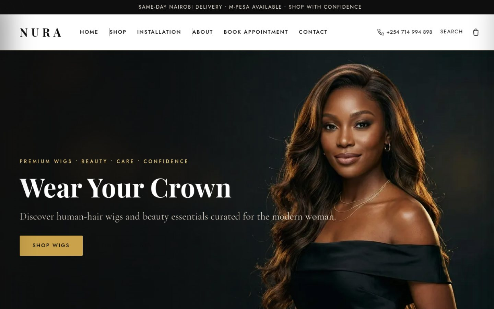
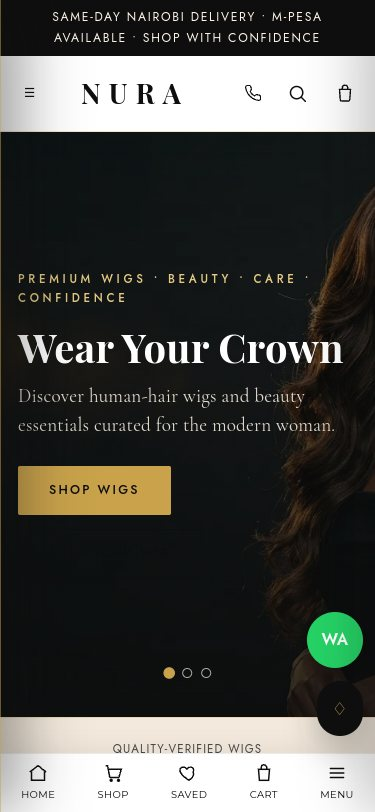
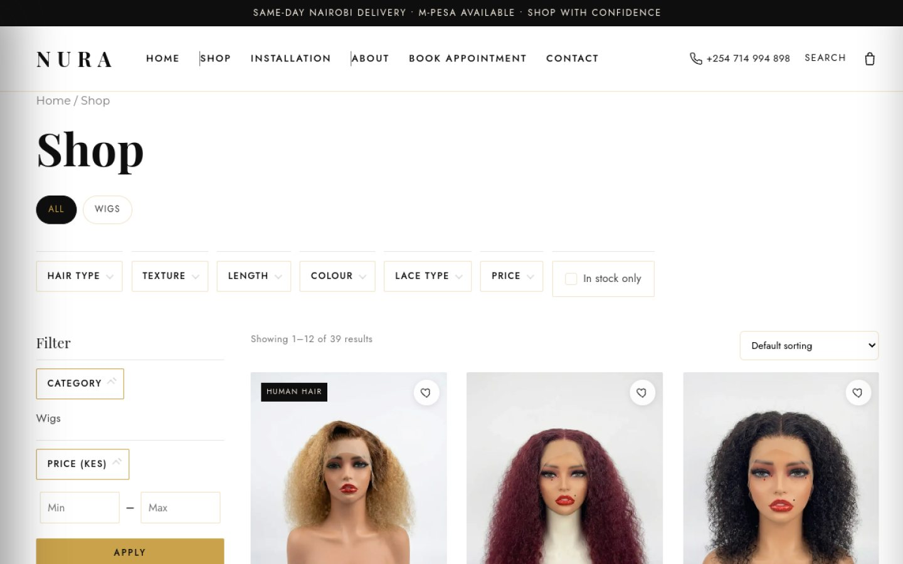
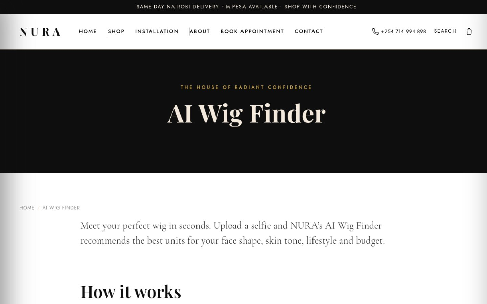
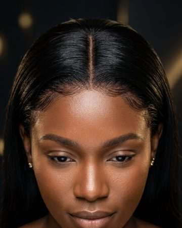
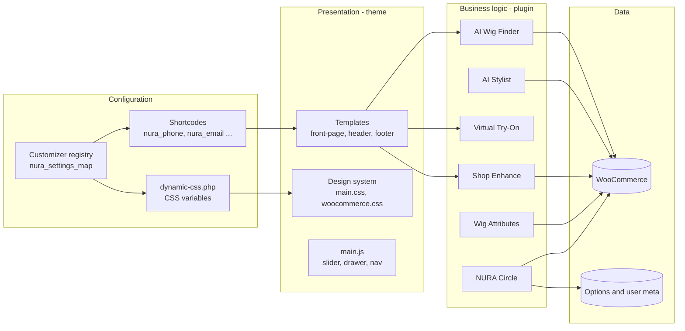
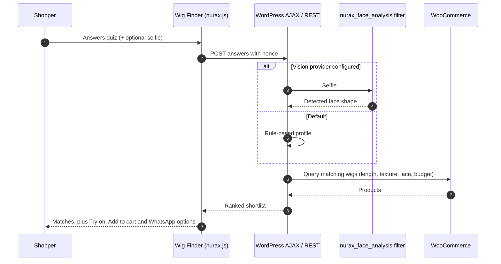
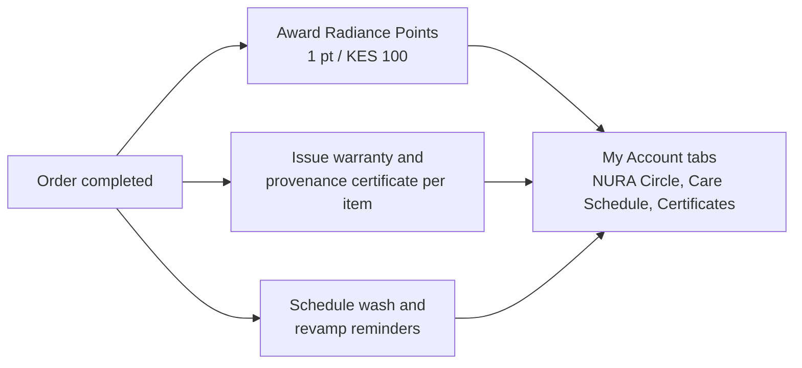
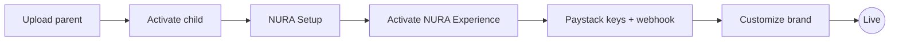

<div align="center">


# NURA Beauty

**The House of Radiant Confidence**

Custom WordPress + WooCommerce storefront for **[nurabeauty.co.ke](https://nurabeauty.co.ke/)** - premium wigs, hair and beauty, hand-finished in Nairobi and built for how Kenyans shop online.

<br>

[\](nura-beauty)
[\](nura-experience)
[\](https://nurabeauty.co.ke/)

\
\
\
\
\
\

<br>

**[Visit the store](https://nurabeauty.co.ke/)** &nbsp;&bull;&nbsp; [Shop](https://nurabeauty.co.ke/shop/) &nbsp;&bull;&nbsp; [AI Wig Finder](https://nurabeauty.co.ke/ai-wig-finder/) &nbsp;&bull;&nbsp; [Install](#installation) &nbsp;&bull;&nbsp; [Deploy](#deploying-an-update) &nbsp;&bull;&nbsp; [Releases](#release-history)

</div>

<br>

<p align="center">
  
  &nbsp;
  
</p>

<br>

## At a glance

<table>
  <tr>
    <td width="25%" align="center"><h3>2 + 1</h3><sub>Packages: theme, plugin<br>and child theme</sub></td>
    <td width="25%" align="center"><h3>M-Pesa</h3><sub>STK push and card via Paystack,<br>bank transfer, cash on delivery</sub></td>
    <td width="25%" align="center"><h3>5pm</h3><sub>Same-day Nairobi cut-off,<br>1 - 3 days countrywide</sub></td>
    <td width="25%" align="center"><h3>1 tap</h3><sub>WhatsApp order with product,<br>colour, quantity and price</sub></td>
  </tr>
</table>

## Contents

| | | |
| --- | --- | --- |
| [Packages](#packages) | [Shopping experience](#shopping-experience) | [Screenshots](#screenshots) |
| [Collections](#collections) | [Architecture](#architecture) | [Project structure](#project-structure) |
| [Installation](#installation) | [Deploying an update](#deploying-an-update) | [Configuration](#configuration) |
| [Shortcodes and REST](#shortcodes-and-rest-api) | [Release history](#release-history) | [Business](#business) |

## Packages

| Package | Folder | Version | Role |
| --- | --- | :---: | --- |
| **NURA Beauty** | [`nura-beauty/`](nura-beauty) | `1.32.2` | Parent theme: storefront, design system, header search, checkout, Customizer, SEO schema |
| **NURA Beauty Child** | [`nura-beauty-child/`](nura-beauty-child) | `1.0.0` | **Active theme.** Update-safe layer for site-specific CSS and PHP |
| **NURA Experience** | [`nura-experience/`](nura-experience) | `1.45.0` | Plugin: AI Stylist chat, AI Wig Finder, Quick View, WhatsApp order pop-up + WhatsApp Orders admin, mobile bottom bar, policy pages, NURA Circle |

> [\!NOTE]
> Nothing brand-specific is hard-coded. Colours, fonts, contact details, social links, announcement bar and hero copy are edited under **Appearance > Customize > NURA Options**.

## Shopping experience

Designed around how Kenyan shoppers actually buy: on a phone, with M-Pesa, and often finishing the order on WhatsApp.

<table>
  <tr>
    <td width="33%" valign="top">
      <h4>Find it fast</h4>
      <ul>
        <li>Always-visible header search bar with live product results (photo + price)</li>
        <li>"Not found" offers WhatsApp help instead of a dead end</li>
        <li>Mega menu on desktop, Home | Shop | WhatsApp | Cart | Menu bar on mobile</li>
        <li>AI Wig Finder quiz and NURA Stylist chat</li>
      </ul>
    </td>
    <td width="33%" valign="top">
      <h4>Choose with confidence</h4>
      <ul>
        <li>Colour and length swatches on product pages and in Quick View</li>
        <li>Chosen value shown next to the label; sold-out options greyed out</li>
        <li>Every wig labelled human hair, human-hair blend or heat-resistant fibre</li>
        <li>Clear delivery, returns (7 days) and payment info on every product</li>
      </ul>
    </td>
    <td width="33%" valign="top">
      <h4>Pay the Kenyan way</h4>
      <ul>
        <li>M-Pesa and card via Paystack, bank transfer, cash on delivery in Nairobi</li>
        <li>Short checkout: phone first and required, County + Town, no postcode</li>
        <li>Free-delivery progress bar in the cart</li>
        <li>Order on WhatsApp with product, colour, quantity, price and link pre-filled</li>
      </ul>
    </td>
  </tr>
</table>

<details>
<summary><b>Full feature list</b></summary>

<br>

**Storefront (NURA Beauty theme)**

- Editorial luxury design: obsidian black, champagne gold `#C9A24B`, warm ivory; Playfair Display, Cormorant Garamond, Montserrat and Jost
- Hero slider, trust bar, category tiles, Shop by wig type, New Arrivals, Best Sellers (no duplicates between rails), Real Women gallery, Wig Care, Talk to NURA
- Balanced header: logo, centred search, phone, account and cart
- AJAX cart drawer with quantity steppers; free-delivery bar read from WooCommerce Free Shipping
- Footer with social icons (Instagram, TikTok, Facebook, YouTube, Pinterest, X, Threads) and payment badges taken from the live payment gateways
- One-click onboarding under *Appearance > NURA Setup*

**Experience layer (NURA Experience plugin)**

| Module | What it does |
| --- | --- |
| **NURA Stylist** | Chat concierge (OpenAI or Gemini, with guided fallback replies), Kenyan quick replies and one-tap WhatsApp hand-off |
| **AI Wig Finder** | Quiz on face shape, lifestyle and budget that recommends matching products |
| **Quick View** | REST-powered product pop-up with full variation picker and AJAX add to cart |
| **WhatsApp ordering** | Pre-filled order message from product pages, Quick View, the bottom bar and the floating button |
| **Policy & trust pages** | Delivery, Returns & Refunds, Payment Information, FAQ, Terms, Privacy - kept consistent with checkout and schema |
| **The NURA Circle** | Loyalty points, care reminders and certificates in My Account |
| **Virtual Try-On** | Built in, currently **switched off** for the Kenyan market (`NURAX_ENABLE_TRYON`) |

</details>

## Screenshots

| Shop with wig filters | AI Wig Finder |
| :---: | :---: |
|  |  |

## Collections

<table>
  <tr>
    <td align="center"><br><sub><b>Wigs</b><br>Human hair, blend, fibre</sub></td>
    <td align="center"><br><sub><b>HD Lace Front</b><br>Invisible hairline</sub></td>
    <td align="center"><br><sub><b>Ready-to-Wear</b><br>Glueless, everyday</sub></td>
    <td align="center"><br><sub><b>Bridal & Occasion</b><br>Made for the big day</sub></td>
    <td align="center"><br><sub><b>Confidence Line</b><br>Comfort first</sub></td>
  </tr>
</table>

## Architecture

<details>
<summary><b>System context, layers and flows (diagrams)</b></summary>

<br>

#### System context

```mermaid
flowchart TB
    subgraph Users
        C[Shopper - web and mobile]
        A[Store admin]
    end
    subgraph WP["WordPress - nurabeauty.co.ke"]
        direction TB
        CH[NURA Beauty Child<br/>active theme]
        PT[NURA Beauty<br/>parent theme]
        NX[NURA Experience<br/>plugin]
        WC[(WooCommerce<br/>products, orders, customers)]
        CH --> PT
        PT --> WC
        NX --> WC
    end
    subgraph External["External services (optional)"]
        LLM[OpenAI / Google Gemini]
        VIS[Face-analysis API]
        AR[AR try-on provider<br/>MediaPipe / Banuba]
        WA[WhatsApp]
        GF[Google Fonts]
    end
    C --> CH
    A --> PT
    NX -- AI Stylist REST proxy --> LLM
    NX -- nurax_face_analysis filter --> VIS
    NX -. window.nuraxTryonProvider .-> AR
    CH --> WA
    PT --> GF
```

#### Layered design



#### Flow: AI Wig Finder



#### Flow: NURA Circle loyalty


</details>

## Project structure

<details>
<summary><b>Folder tree</b></summary>

```text
.
├── README.md
├── docs/
│   ├── screenshots/                 # Live-site screenshots used in this README
│   └── images/                      # Optimised collection and lookbook images
├── nura-beauty/                     # Parent theme
│   ├── functions.php                # Lean bootstrap, guarded includes
│   ├── inc/
│   │   ├── setup.php                # Theme supports, menus, image sizes
│   │   ├── enqueue.php              # Critical CSS and async assets
│   │   ├── customizer.php           # Single registry of every brand setting
│   │   ├── dynamic-css.php          # Customizer values to CSS variables
│   │   ├── woocommerce-support.php  # Shop and product integration
│   │   ├── seo-schema.php           # JSON-LD, Open Graph, Twitter
│   │   ├── shortcodes.php           # Brand value, contact and booking shortcodes
│   │   ├── template-tags.php        # Template helpers
│   │   ├── required-plugins.php     # One-click installer from WordPress.org
│   │   └── sample-data.php / sample-content.php
│   ├── assets/{css,js,images}/      # Design system, main.js, hero and category photos
│   ├── demo/pages/*.html            # Starter page content
│   ├── front-page.php  header.php  footer.php  page.php  single.php ...
│   └── style.css                    # Theme header only
├── nura-beauty-child/               # Child theme (activate this)
└── nura-experience/                 # Experience plugin
    ├── nura-experience.php          # Bootstrap and shared assets
    ├── includes/
    │   ├── class-ai-wig-finder.php
    │   ├── class-ai-stylist.php
    │   ├── class-virtual-tryon.php
    │   ├── class-nura-circle.php
    │   ├── class-shop-enhance.php
    │   ├── class-wig-attributes.php
    │   └── class-settings.php
    ├── assets/{css,js}/nurax.*
    └── samples/nura-variable-products-template.csv
```

</details>

## Installation

> **Requirements:** WordPress 6.2+ &nbsp;&bull;&nbsp; WooCommerce 8.0+ &nbsp;&bull;&nbsp; PHP 7.4+

1. Upload **`nura-beauty/`**, then **`nura-beauty-child/`** under *Appearance > Themes > Add New > Upload Theme*.
2. **Activate NURA Beauty Child** (not the parent).
3. Run **Appearance > NURA Setup**: install plugins, then import sample content.
4. Upload **`nura-experience/`** to `wp-content/plugins/` and activate it.
5. Install **Paystack WooCommerce Payment Gateway**, add your live keys and the webhook URL in the Paystack dashboard.
6. Re-save **Settings > Permalinks**.



## Deploying an update

> [\!IMPORTANT]
> Commits to `main` do **not** deploy automatically. Every release bumps the version numbers so you can see what is live.

| Step | Action |
| :---: | --- |
| 1 | Download the changed folder(s): `nura-beauty/` and/or `nura-experience/` |
| 2 | Upload them to `wp-content/themes/` and `wp-content/plugins/` on hosting (replace existing) |
| 3 | Clear the caching plugin and any hosting cache |
| 4 | Check the version in *Appearance > Themes* and *Plugins* matches the badges above |
| 5 | Test on a phone: search, add to cart, checkout with M-Pesa, Order on WhatsApp |

## Configuration

| Where | What you can change |
| --- | --- |
| **Customize > NURA Options > Brand** | Name, tagline, bio, announcement bar, phone, WhatsApp, email, address, hours, social profile links |
| **Customize > NURA Options > Colours / Typography** | Brand colours and Google Font families |
| **Customize > NURA Options > Homepage** | Trust bar and feature blocks |
| **WooCommerce > Settings > Payments** | Paystack (M-Pesa + card), bank transfer, cash on delivery - the site labels follow automatically |
| **WooCommerce > Settings > Shipping** | Free-shipping minimum - drives the cart progress bar and product delivery text |
| **Settings > NURA Experience** | AI Stylist key and greeting, WhatsApp number, loyalty options |

## Shortcodes and REST API

| Shortcode | Output |
| --- | --- |
| `[nura_ai_wig_finder]` | AI Wig Finder quiz and results |
| `[nura_circle_portal]` | NURA Circle client portal |
| `[nura_contact_form]` | Contact form (Contact Form 7 when available) |
| `[nura_phone]` `[nura_email]` `[nura_address]` `[nura_hours]` `[nura_whatsapp]` | Live brand values from the Customizer |

REST namespace `nurax/v1`: `POST /stylist` (chat), `GET /quickview?id=` (Quick View).

<details>
<summary><b>Extending with AI providers</b></summary>

<br>

```php
// Plug a real face-shape vision model into the AI Wig Finder.
add_filter( 'nurax_face_analysis', function ( $shape, $image ) {
    // Call your provider and return e.g. 'oval', 'round', 'heart', 'square'.
    return $shape;
}, 10, 2 );
```

```js
// Swap in a face-tracked AR engine for Virtual Try-On; the UI stays identical.
window.nuraxTryonProvider = { align: (photo, wig) => { /* MediaPipe / Banuba */ } };
```

</details>

## Release history

| Theme | Plugin | Highlights |
| :---: | :---: | --- |
| - | `1.45.0` | Fix: Order on WhatsApp now opens the order pop-up instead of going straight to WhatsApp |
| - | `1.44.0` | Redesigned WhatsApp order pop-up: 3-step progress, product card with category, sale price and quantity, +254 phone field, delivery / pick-up and payment option cards, sticky total + Send order button |
| - | `1.43.0` | WhatsApp order pop-up on product page, every product card and cart (variation, qty, delivery, payment, ref NURA-YYMMDD-XXXX); orders saved under WooCommerce > WhatsApp Orders |
| `1.32.2` | - | Aligned product cards: reserved shade row, fixed price row, full-width buttons pinned to the bottom |
| `1.32.1` | - | Equal two-line product titles on every card; semi-human and bone straight category intros |
| `1.32.0` | `1.42.0` | SEO for Kenyan wig searches: keyword H1, homepage wig guide + FAQ schema, Product shipping/returns schema, image alt text, LocalBusiness areas |
| `1.31.1` | - | Mobile: only one WhatsApp (bottom bar); floating bubble hidden on phones |
| `1.31.0` | `1.41.0` | WhatsApp bubble with real logo, redesigned NURA Stylist button and chat, one-line mobile announcement bar |
| `1.30.0` | `1.40.0` | Mobile bottom bar: Home, Shop, WhatsApp, Cart, Menu; visible chat button |
| `1.29.0` | - | Simple Kenyan checkout: phone required and first, no postcode, County + Town |
| `1.28.x` | `1.39.0` | Add to cart + Order on WhatsApp buy box, full WhatsApp order message, clean single search box |
| `1.27.0` | - | Balanced header with Account link |
| `1.26.0` | - | Colour picker works in Quick View |
| `1.25.x` | - | Always-visible header search bar; footer payment badges from live gateways |
| `1.24.x` | `1.38.x` | Consistent policies (5pm same-day, 7-day returns), honest hair-type copy, Paystack payment copy |
| `1.23.x` | `1.37.1` | Social profile links and icons; cart drawer layout fix |
| `1.22.x` | `1.37.0` | Virtual Try-On switched off, Quality-Checked Hair, Paystack labels |

## Business

<table>
  <tr>
    <td valign="top">
      <b>NURA Beauty</b> - The House of Radiant Confidence<br>
      Imenti House, Moi Avenue, Nairobi CBD, Kenya<br><br>
      Phone / WhatsApp: <a href="tel:+254714994898">+254 714 994 898</a><br>
      Email: <a href="mailto:care@nurabeauty.co.ke">care@nurabeauty.co.ke</a><br>
      Mon - Sat, 9:00 - 18:00
    </td>
    <td valign="top">
      <b>Delivery</b><br>
      Same-day Nairobi on orders before 5pm<br>
      Countrywide in 1 - 3 days<br><br>
      <b>Returns</b><br>
      Unworn, unaltered units within 7 days
    </td>
  </tr>
</table>

---

<div align="center">
<sub>Designed, developed and maintained by <a href="https://github.com/moselanto"><b>Pimofy Digital</b></a>, Nairobi &nbsp;&bull;&nbsp; Licensed GPLv2 or later</sub>
</div>
